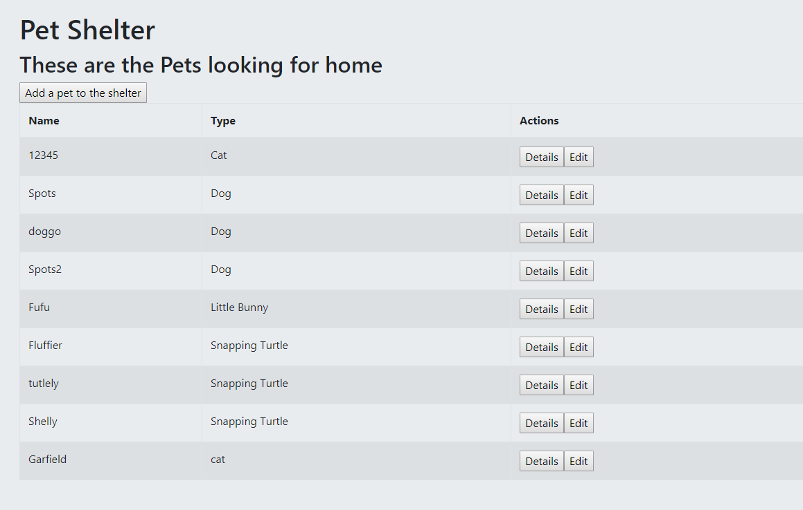
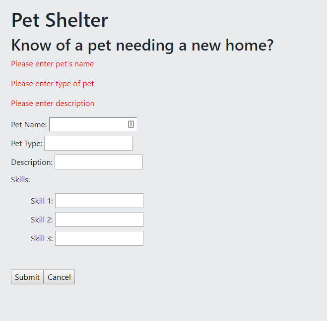
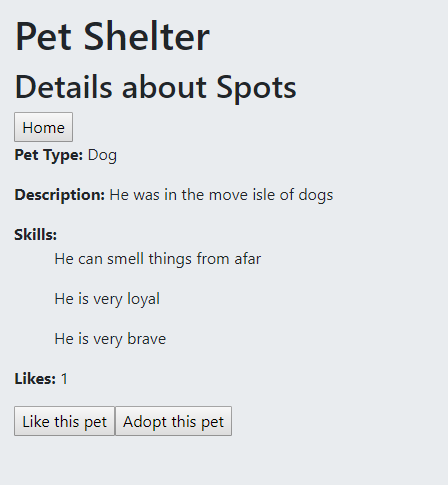

# Pet Shelter
Pet Shelter is a website to manage pets needing to be adopted. 

## Technologies used:
- JavaScript
- Express
- Angular
- Node JS
- HTML
- CSS
- Bootstrap
- MongoDB
- mongoose
- Amazon Web Services EC2
- modularization

## Features:
- View all the pets needing a new home

- Add a new pet
- Form validation

- View Details of the pet
- Like button
- Adopt the pet (delete from the list)

